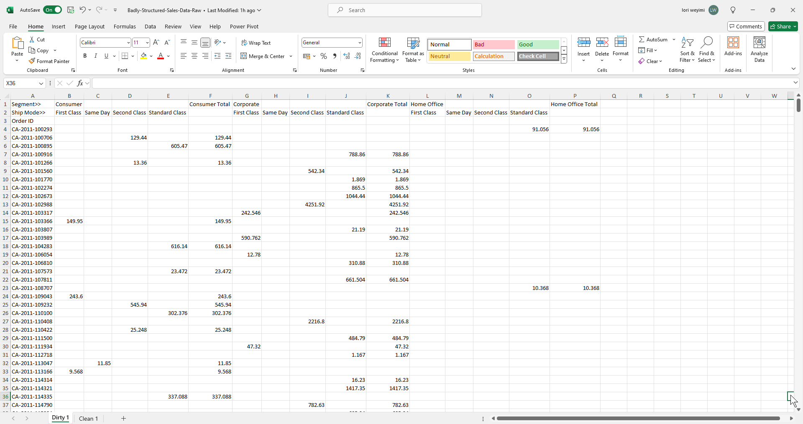
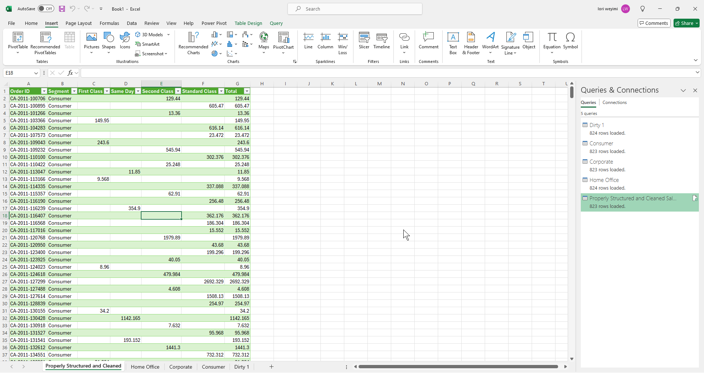
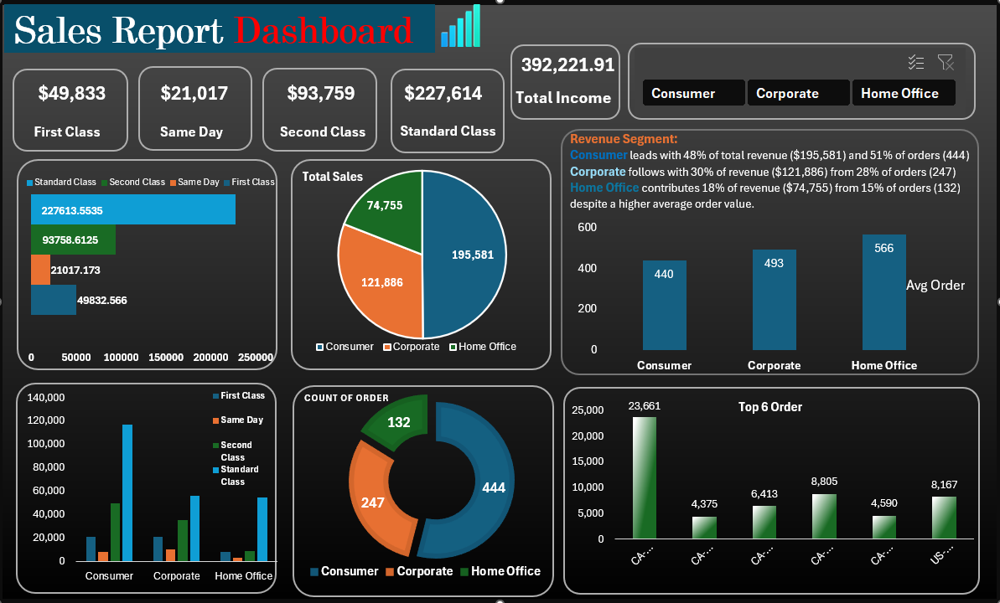

# Transformation-of-Badly-Structured-Sales-Data

# Introduction

The company is experiencing disparate revenue and order volumes across its three key segments—Consumer, Corporate, and Home Office. Despite the Consumer segment leading in both revenue and order volume, 
and Home Office achieving the highest average order value, total revenue from Home Office remains the lowest. 

## Problem Statement

The current product mix and delivery options may not be optimized for segment-specific needs, potentially limiting growth opportunities. 

There is a critical need to organize the poorly structured dataset to enable effective analysis, drive higher sales and profitability, and ultimately support informed decision-making.

Objectives:

1.  Improve Sales Structure:
    It is imperative to create a better sales structure for the company.
    
2.  Maintain Reporting Structure: Establish a pipeline for maintaining the structure of monthly reports.

3.  Sales Analysis:
    Identify the top-selling segment and best-selling class.

4.  Profit Margin Analysis:
    Determine which class categories and customer segments generate the highest profit margins.
    Analyze the factors contributing to these margins.

5.  Recommendations:
    Provide recommendations for improving income and profitability.

# Project Overview:

## Data Transformation, Cleaning and Pipeline Process.

This project involved a comprehensive ETL (Extract, Transform, Load) process and the construction of a data pipeline entirely in Microsoft Excel.

## ETL Process:

1. Extraction:
   
   In a new Excel worksheet, I navigated to the "Data" tab and selected the "Get Data" option.
   I extracted data from a Microsoft Excel (.xlsx) file and loaded it into the Excel Power Query Editor to begin the transformation and cleaning process.

2. Transformation:

   A. Normalization:

        a. 	Dataset Duplication: I duplicated the dataset into three separate tables for distinct processing needs.
   
        b.	Renaming and Cleaning: Each table was renamed, and redundant rows and columns were removed.

        c.	Data Transposition: I transposed the data from Row A1 into Column B2 and set the data type to text,

                thereby restructuring it into an acceptable format.

        d.	Column Population: Populated the new column with relevant details.

          I.	Header Creation: Created new headers for the entire table.
   
         II.	Row Deletion: Deleted the first three rows to finalize the normalization process.

   B. Data Cleaning:

          a. Missing Values: Checked for and handled missing values.
   
          b. Duplicates: Identified and removed duplicate values.
   
          c. Redundant Data: Removed any remaining redundant columns or rows.

   C. Data Merging:
   
          I combined the three tables into a single, cohesive table on a new sheet, thereby completing the restructured dataset.

   D.  Data Pipeline:

          This sequence of data extraction, transformation, and loading in power query effectively creates a data pipeline.

          The pipeline ensures data flows seamlessly from the source to the cleaned and transformed state, ready for analysis.

4. Loading:
   
          Loaded the cleaned and transformed data back into Excel for further analysis and modelling.

# Modelling:

   Created Key Performance Indicators (KPIs) and pivot tables in a new sheet.

   Ensured accuracy by cross-checking all calculations and cross-referencing relevant pivot tables.

# Dashboard Development:

Designed the dashboard background by clearing all gridlines and inserting necessary buttons.

Populated the dashboard with KPIs and incorporated filters to enhance data analysis.

By following this structured process, the project ensures accurate and efficient data preparation, enabling robust analysis and insightful dashboard reporting.

The chart below displays the poorly structured and raw sales data.

The chart below illustrates the results of the ETL process.

The dashboard below presents the results of a thorough Analysis.

# Executive Summary:

## Overview:

This dashboard provides an analytical overview of the sales performance across three key segments: Consumer, Corporate, and Home Office. 

Each segment encompasses four delivery classes: First Class, Same Day, Second Class, and Standard Class. 

## Revenue Analysis:

Consumer Segment:  Generated the highest revenue with $195,581.

Corporate Segment: Contributed $121,886 in revenue.

Home Office Segment: Accounted for $74,755 in revenue.

## Order Analysis:

Consumer Segment: Recorded the highest number of orders with 444.

Corporate Segment:  Placed 247 orders.

Home Office Segment: Placed 132 orders.

## Profit Analysis:

The total profit across all segments is $392,222, distributed as follows:

## Consumer Segment:

 First Class: $20,802
 
 Same Day: $8,132
 
 Second Class: $49,724
 
 Standard Class: $116,922

## Corporate Segment:

 First Class: $20,793
 
 Same Day: $9,907
 
 Second Class: $35,243
 
 Standard Class: $55,943

## Home Office Segment:

 First Class: $8,238
 
 Same Day: $2,977
 
 Second Class: $8,791
 
 Standard Class: $54,749

## Average Order Value:

Consumer Segment: 440.51

Corporate Segment: 493.06

Home Office Segment: 566.29 

## Recommendations for Improving Sales and Profit:

1. Targeted Marketing Campaigns:
I.	Focus marketing efforts on the Consumer segment, which has shown the highest revenue and order volume, to further boost sales.
II.	Develop specialized campaigns for the Corporate and Home Office segments to increase their order volume and revenue.

2. Delivery Class Optimization:
Analyze the profitability of each delivery class within segments and promote 
higher-margin delivery options to customers.

3. Customer Incentives:
Introduce loyalty programs or discounts for repeat purchases, especially targeting segments with lower order volumes like Home Office.

4. Enhanced Customer Experience:
Improve the overall customer experience by streamlining the ordering process, offering faster delivery options, and providing excellent post-purchase support.

5. Product Mix Adjustments:
   
   I.	Review which products are currently selling well in each segment (Consumer, Corporate, Home Office).

   II.	Look for patterns in what types of products are most popular within each segment.

    III.	Gather information directly from customers to understand their needs and preferences.

    IV.	Use industry reports and competitor analysis to identify emerging trends and high-demand products in the market.

    V.	Add new products that align with the identified preferences and needs of each segment.

    VI.	Phase out products that are not performing well to make room for more popular items.

    VII.	Focus on products that appeal to individual buyers, such as personal use items or household goods.

    VIII.	Offer products that cater to business needs, such as office supplies, bulk items, and professional services.

    IX.	Create marketing campaigns that highlight the new, high-demand products specific to each segment.

    X.	Offer special deals and bundles tailored to the needs of each segment to encourage more purchases.

7. 	Continuous Monitoring and Adjustment:
   
       Track Performance: Regularly review sales data to see how the new product mix is performing.

       Feedback Loop: Continuously gather customer feedback to make further adjustments as needed.

By implementing these strategies, we can aim to boost sales and enhance profitability while improving customer satisfaction across all segments.

